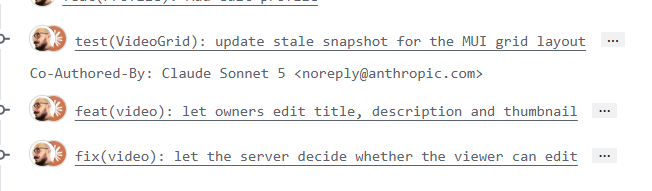
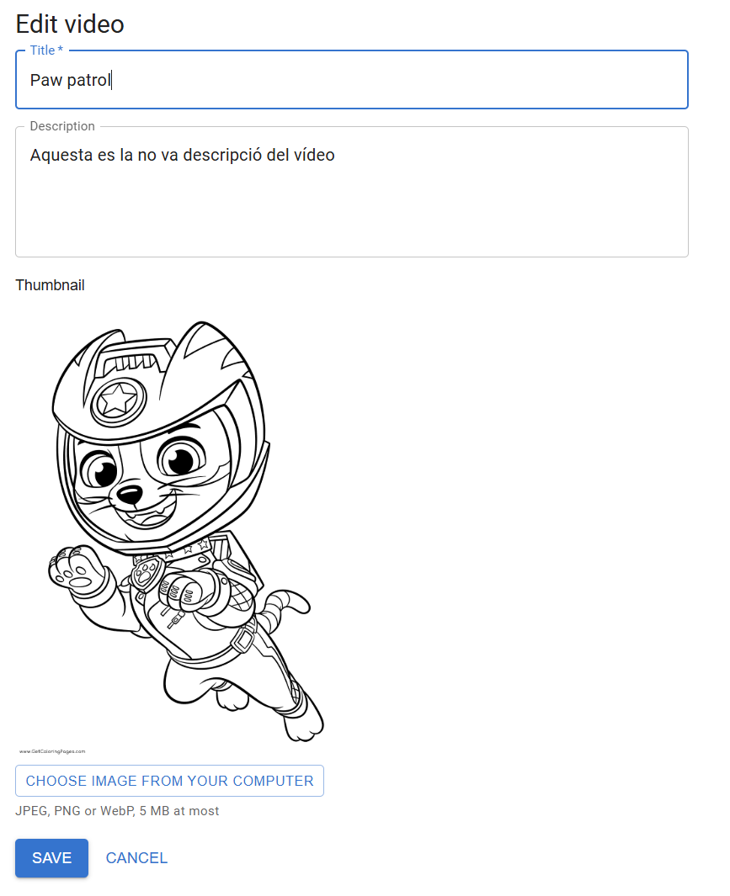
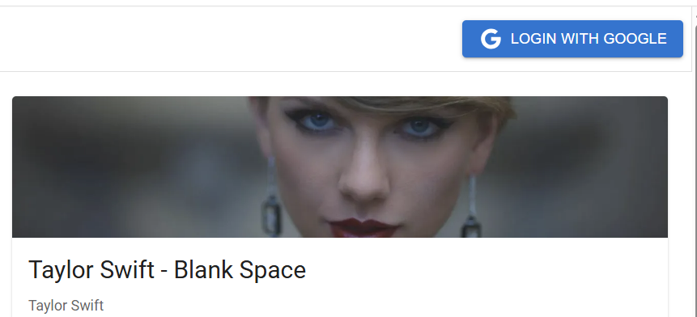
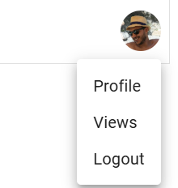
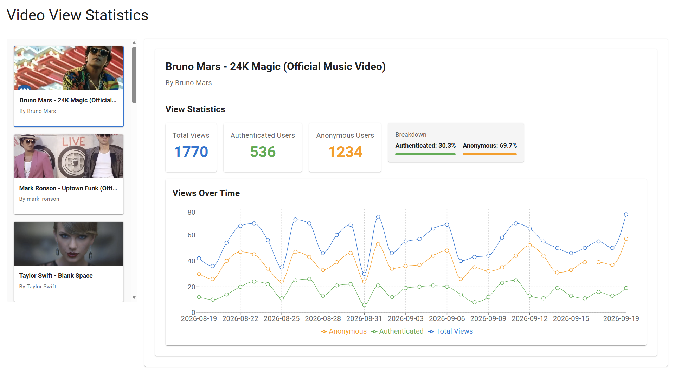

# Pro tube project

## Project

The project consists of building a web application where the user can watch and comment on videos uploaded by
themselves and other registered users.

### Goals

The goal of this exercise is to reproduce, as much as possible, a REAL group work environment by creating a
well-defined project from scratch and developing it using Agile methodologies.

### Teams

You have to create groups of 3-4 people to develop the project. It depends on the team, but the main idea is to have
at least one person in charge of the definition of the features (Product owner/manager).

### Evaluation

The evaluation of the subject depends on 2 parts:

* **70%** Practical (Delivery of the project). Even though the work is done in teams, the evaluation will be
  individual. The evaluation will depend on the quality of the code, architecture, etc. and also the features
  implemented.
* **30%** Exam (This will be an exam asking about your delivery, how you implemented something, how you would plan
  the integration of a new feature –how would you structure it–, etc.)
  
> # ⚠️
> Even though the project has to be done in teams, the evaluation will be individual and will follow a continuous
> evaluation process.


⚠️ The minimum grade in both parts required to pass the subject is 3. If the exam is not passed with a grade higher
than 3, the student is entitled to a resit exam.

### Usage of AI
 AI is a powerful tool that can help you to improve your code, architecture, etc. You can use it to help you with the project, but you have to be careful and not use it to do the work for you. You have to understand the code generated by AI and be able to explain it. You have to be able to justify the decisions made by AI and also be able to explain why you didn't use AI in some parts of the project.

#### Setting up AI
A configuration file(s)  should be provided following the best practices of the AI tool used. The configuration file(s) should be committed to the repository and should be used by all the members of the team. The configuration file(s) should be agreed and reviewed by the team and approved before starting to use AI in the project.

#### Preservation of the prompts
One of the instructions of the project is to preserve the prompts used to generate code, architecture, etc. The prompts should be committed to the repository inside a specific folder and, should be used by all the members of the team. The prompts should be agreed and reviewed by the team and approved before starting to use AI in the project.

### Track of the changes
All the commits where AI is used to generate code, architecture, etc. should be clearly marked in the commit message. The commit message should contain a reference to the prompt used to generate the code, architecture, etc. The commit message should also contain a reference to the task where the code, architecture, etc. is used.


### Code contribution

* All contributions will be done via Pull Request, leaving the main branch locked from direct commits.
* The pull request has to be reviewed by other members of the team and approved by **AT LEAST** one person.
* Commits should clearly describe the changes made and should contain a reference to the task, e.g.
  using [conventional commits](https://www.conventionalcommits.org/en/v1.0.0/#summary)
* How to [set up a project](./docs/GITHUB_SETUP.md) following best practices
* All the PR have to be reviewed and approved by at least one member of the team. The PR can be merged only after the approval of at least one member of the team.
* Copilot have to be activated for reviewing the code on PR. All comments done by Copilot have to be resolved before merging the PR.

> The commitment of all members has to be visible through their contribution (amount & quality) to the repository.
> To avoid a situation where some members of the team do the vast majority of the work while others do less, the
> evaluation will take into account the contribution of every member of the team. Ideally, the percentage of
> commits/lines changed should be balanced across all members of the team.

### Agile

Each team is responsible for selecting the agile framework that best fits their workflow. Adherence to agile
methodologies is essential, including the definition and execution of ceremonies such as Daily Standups,
Refinement/Grooming, Retrospectives, Demos, and others as appropriate.
Ideas to track the progress and stories:

* [Github Projects](https://github.com/projects)
* [Jira](https://www.atlassian.com/software/jira/service-management)
* [Trello](https://trello.com/)

#### Agile ceremonies

| Name                | Description                                                                                                                                                                                                                                                   | Duration                                   | Frequency                          | Outcome                                                                                                                      |
|---------------------|---------------------------------------------------------------------------------------------------------------------------------------------------------------------------------------------------------------------------------------------------------------|--------------------------------------------|------------------------------------|------------------------------------------------------------------------------------------------------------------------------|
| Daily               | Report of the current status of the sprint                                                                                                                                                                                                                     | 10min                                      | Every day                          | In this ceremony the team has to talk about the work, detect any possible blockers and check the status of the sprint goal   |
| Retrospective       | Meeting to look back on the previous sprint and identify strengths and weaknesses                                                                                                                                                                              | 1h                                         | At the end of the Sprint           | The outcome of the retrospective is to create Action points to be tackled in the following sprints                           |
| Refinement/Grooming | In this meeting the team has to talk about upcoming stories, detect potential issues or dependencies and estimate every task                                                                                                                                  | 1h                                         | Once a week/sprint                 | Tasks with all the requirements discussed and also an estimation of effort for each task                                     |
| Demo/Sprint review  | This meeting is for the stakeholders of the project, and the team has to show the new features introduced in the sprint                                                                                                                                       | 30min max                                  | At the end of the sprint           | Retrieve feedback from stakeholders                                                                                          |
| Post mortem         | On-demand meeting that consists of analyzing critical issues that happened in the past.                                                                                                                                                                        | Depending on the # of tasks to be discussed | On demand at the end of the sprint | The outcome is to create Action points to prevent the analyzed issue from happening again in the future                      |
| Planning            | This is the closing sprint ceremony. All unfinished tasks will be moved to the following sprint. The team also decides the effort capacity it will have for the next sprint and, according to that capacity, decides the tasks to be tackled in the next sprint | 30min                                      | On demand at the end of the sprint | The work to do in the next sprint                                                                                            |

### MVP

The MVP consists of creating a basic web application with the following features:

#### EVALUATION (6)
* Authentication (Basic Register/login, etc.)
* View list of videos (using videos generated by `videoGrabber` tool)
* Persistence using a database (not in memory or h2)
* Upload videos for authenticated users
* Analytics for authenticated users
* Play a video and show information about the video (title, description, comments, etc.)
* Presentations of the progress on sprint reviews/demo
* Search engine to search videos by title, description, etc.
* Comments (replies, likes, etc.)
* User profile (avatar, description, etc.)
* Video metadata editor (tags, description, category, etc.)
* E2E tests (Cypress, Selenium, etc.)*
* Use of containerization (docker-compose) to deliver the application.* 
* Validation of the changes via a CI pipeline (Github Actions)
* **EVERYTHING** has to be well tested and have more than 50% of coverage

[Here](./REQUIREMENT.md) you can find a more detailed description of the MVP.

#### Example of sprint review/demo

* What we committed to do
    * A list of tasks the team committed to before starting the sprint
* What we finally did
    * A list of tasks the team finally did
* Demo of the new features
    * Presentation of the PRODUCT. The presentation is focused on the product: how it works, etc.
* What went well
* Problems found
    * Explanation of what the team found during the sprint
    * How the team solved it
    * Explanation of why the team did not finish all the tasks committed to
* Next steps
    * A list of tasks the team wants to do in the next sprint

#### Example of MVP

Below you can find some examples of the new feature.
Home page example


Video player example



Authentication example



Analytics example


### Improvements

To increase your grade, you have to add more features to the MVP. The more features you add, the higher your grade
will be. The maximum grade is 10.
The group is free to decide which features they want to add.
Another way to increase the grade is to improve the quality of the code, architecture, etc., using tools such as
SonarQube, ESLint, a good CI/CD pipeline (Github Actions), E2E tests, etc.
We list a set of potential improvements, BUT every team can decide on others by themselves.
Depending on the complexity of the feature, the grade will increase more or less.

**Product:**

* Authentication with OAuth or other similar system
* Rating videos
* Mobile/Responsiveness
* Favorite videos
* Subscriptions to other users
* Dark mode
* Internationalization (i18n)
* Accessibility (a11y)

**Engineering:**

* Code quality toolings (SonarQube, ESLint, etc.)
* More than 90% of test coverage
* Use a static server to save resources (Cloudinary, AWS S3, etc.)
* Use of a caching system (Redis, Memcached, etc.)
* Use of design patterns
* Documentation (Swagger, JSDocs etc.)
* Use of microservices architecture
* Hexagonal architecture
* Kubernetes deployment
* Deploy app on a hyperscaler (AWS, Azure, GCP, etc.)

**Agile:**

* Keeping all ceremonies on every sprint
* Use of Gitflow or other similar branching model
* Use of Jira, Trello or other similar tool to manage the project
* Use of Confluence or other similar tool to document the project
* Use of Slack or other similar tool to communicate with the team
* Use of Miro or other similar tool to create diagrams, flowcharts, etc.
* Use of Figma or other similar tool to create mockups, wireframes, etc.
* Creating a good backlog with user stories, tasks, etc.

**Other:**

* ⚠️ Any other kind of improvement the team decides on has to be discussed with the professor before starting to
  work on it.

## Tech requirement

Before starting coding you have to be sure you have the following software already installed:

### Backend

* Java 21 ([correto](https://docs.aws.amazon.com/corretto/latest/corretto-21-ug/downloads-list.html) recommended)
* [Maven](https://maven.apache.org/index.html) 3.9x

### Frontend

* [Node 22](https://nodejs.org/en/download) (Latest LTS version)
* [npm 9x](https://www.npmjs.com/get-npm) (Latest LTS version)

### Database

* By default, the [h2 database](https://h2database.com/html/main.html) is used. For the final delivery, the data has
  to be persisted in a database selected by the team. It's important to note that since the delivery is dockerized,
  the database must be installed there as well. The choice of database remains up to the team, although it's
  strongly recommended to use PostgreSQL

### Video grabber

* Python 3x
    * On Linux / Windows with WSL
      ```commandline
      sudo apt-get update
      sudo apt-get install python3 python3-pip
      ```
    * On macOS: Use Homebrew to install Python:
      ```commandline
      brew install python
      ```
    * On Windows: Download the Python [installer](https://www.python.org/downloads/windows/) from the official Python
      website. Run the installer and ensure that you check the option to add Python to your system’s PATH during the
      installation process.
* Other deps

    You'll need unzip (in case of wsl), deno and ffmpeg 
    * On Linux / Windows with WSL
    Install them using your package manager. For example, on Ubuntu:
      ```commandline
        sudo apt-get update
        sudo apt-get install ffmpeg unzip
        curl -fsSL https://deno.land/install.sh | sh
      ```
    * Windows: Download the ffmpeg [executable](https://ffmpeg.org/download.html) from FFmpeg’s official website.
      Extract the files and add the bin
      directory to your system’s PATH.
      Deno, using Powershell: 
      ```commandline
      irm https://deno.land/install.ps1 | iex
      ```
    * On macOS: Use Homebrew to install them:
      ```commandline
      brew install ffmpeg
      curl -fsSL https://deno.land/install.sh | sh
      ```

* yt-dlp
    * On Linux / Windows with WSL
      ```commandline
      sudo wget https://github.com/yt-dlp/yt-dlp/releases/latest/download/yt-dlp -O /usr/local/bin/yt-dlp
      // And after:
      sudo chmod a+rx /usr/local/bin/yt-dlp

      ```
    * On macOS
      ```commandline
          brew install yt-dlp
      ```

Remember to remove these packages if you don't want to keep them after the project; you can execute the following
command

```commandline
sudo apt-get remove package // (yt-dlp or ffmpeg)
```

### Backend

Run `ProtubeBackApplication` from the menu on the top right of IntelliJ IDEA. Before that, you should add the
ENVIRONMENT VARIABLE for the folder where the videos are located.


For environment variables (if you don't see it, select it from the Modify Options menu)

```
ENV_PROTUBE_STORE_DIR={stored-folder-absolute-path}
```

Alternatively, the [.env files](https://plugins.jetbrains.com/plugin/9525--env-files) plugin can be used to load
environment variables from a `.env` file. See `.env.example` for an example.

### Frontend

Navigate in a terminal to `frontend` folder and run the following command to install dependencies

```bash
npm install
```

Once dependencies are installed properly run the following code to execute the application in `dev` mode

```bash
npm run dev
```

The command above will open port 5173, which you can access from the browser.

To run the tests

```bash
npm run test
```

## Tooling

### Video grabber

#### Installation

The first step is to have WSL configured on your Windows machine. If you use a Unix-like system (Linux or macOS), you
can follow the steps described above.

This script helps you generate default content for the web application.

Once you have resolved the dependencies explained above you can run the following command inside `tooling/videoGrabber`
folder.

```commandline
python3 main.py --store={Store_Folder} --id=10 --recreate --videos={Path to video_list.txt}
```

Explanation of the parameters:

| Attribute | Type                           | Description                                                                                                     | Example                                                       |
|-----------|--------------------------------|-----------------------------------------------------------------------------------------------------------------|---------------------------------------------------------------|
| id        | integer                        | Number to seed random                                                                                           | `--id=2`                                                      |
| store     | string (path to local machine) | Folder where downloaded videos will be stored                                                                   | `--store=/usr/user/home/videos`                               |
| recreate  | boolean                        | Do overwrite of the store folder                                                                                | `--recreate` or `--recreate=False`                            |
| videos    | string (path to local machine  | Path where the video list is saved. There is a default video list inside the `resources` folder, but it can be overwritten | `--videos=/src/user/home/LS-protube/resources/video_list.txt` |

The command will generate 3 files for every video listed in `resources/video_list.txt`

* *.mp4: The trimmed video
* *.webp: The thumbnail
* *.json: Metadata info about the video

